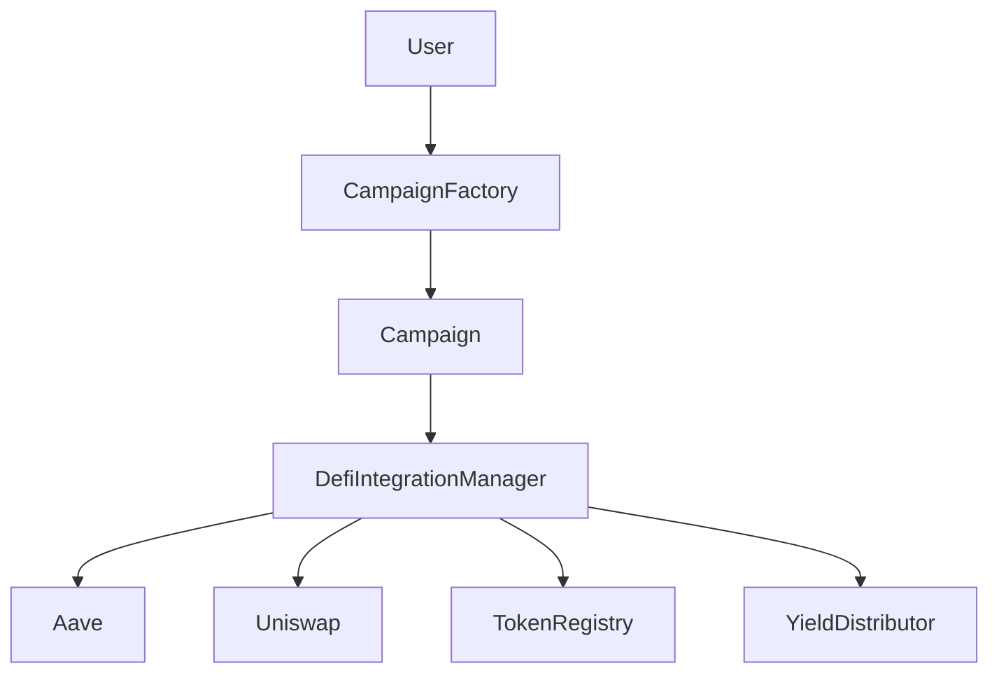

# DeFi-Enabled Crowdfunding Platform

A decentralized crowdfunding platform that integrates with DeFi protocols to generate yield on campaign funds. Built with Solidity for the Ethereum blockchain.

## Features

- Create and manage crowdfunding campaigns
- Accept ETH and ERC20 token contributions
- DeFi integration with Aave for yield generation
- Token swaps via Uniswap
- Automated yield distribution between campaign creators and platform
- Configurable token registry for supported assets
- Campaign lifecycle management
- Refund mechanism for unsuccessful campaigns

## Smart Contracts

### Core Contracts

1. **Campaign.sol**
   - Individual crowdfunding campaign contract
   - Manages campaign lifecycle, contributions, and DeFi interactions
   - Features: 
     - Campaign creation with customizable parameters
     - Contribution handling
     - DeFi yield generation through Aave
     - Token swaps via Uniswap
     - Claim and refund mechanisms

2. **CampaignFactory.sol**
   - Factory contract for deploying new campaigns
   - Maintains registry of all deployed campaigns
   - Manages campaign authorization for DeFi integration

3. **DefiIntegrationManager.sol**
   - Manages all DeFi protocol interactions
   - Integrates with:
     - Aave for yield generation
     - Uniswap for token swaps
   - Handles yield distribution
   - Manages WETH wrapping/unwrapping

### Supporting Contracts

4. **TokenRegistry.sol**
   - Manages supported tokens
   - Configures minimum contribution amounts
   - Handles WETH address management

5. **YieldDistributor.sol**
   - Manages yield distribution logic
   - Configurable platform fee
   - Treasury management

6. **MockERC20.sol**
   - Test ERC20 token implementation
   - Used for testing and development

## Architecture



## Key Features

### Campaign Management
- Customizable campaign duration
- Configurable funding goals
- Campaign status tracking
- Contribution management
- Automated fund distribution

### DeFi Integration
- Yield generation through Aave
- Token swaps via Uniswap
- Configurable yield distribution
- WETH handling for ETH/token conversions

### Security Features
- Reentrancy protection
- Access control
- Slippage protection for swaps
- Error handling and input validation
- Safe token transfers

## Setup and Deployment

### Prerequisites
- Solidity ^0.8.28
- OpenZeppelin contracts
- Aave V3 Core contracts
- Uniswap V3 contracts

### Deployment Steps

1. Deploy supporting contracts:
   ```
   - TokenRegistry.sol
   - YieldDistributor.sol
   ```

2. Deploy core DeFi integration:
   ```
   - DefiIntegrationManager.sol
   ```

3. Deploy campaign factory:
   ```
   - CampaignFactory.sol
   ```

4. Configure contract connections:
   - Set up TokenRegistry with supported tokens
   - Configure YieldDistributor parameters
   - Initialize DefiIntegrationManager with protocol addresses
   - Connect CampaignFactory with DefiIntegrationManager

## Usage

### Creating a Campaign

```solidity
// Through CampaignFactory
factory.deploy(
    goalAmount,
    duration,
    name,
    description
);
```

### Contributing to a Campaign

```solidity
// ETH contributions
campaign.contribute{value: amount}();

// ERC20 contributions
token.approve(campaign, amount);
campaign.contributeToken(token, amount);
```

### DeFi Operations

```solidity
// Deposit for yield
campaign.depositToYieldProtocol(token, amount);

// Harvest yield
campaign.harvestYield(token);

// Swap tokens
campaign.swapTokens(fromToken, amount, toToken);
```

## Security Considerations

1. **Access Control**
   - Owner-only administrative functions
   - Campaign authorization checks
   - Protected DeFi interactions

2. **Fund Safety**
   - Reentrancy protection
   - Safe token transfer handling
   - Slippage protection in swaps

3. **Error Handling**
   - Comprehensive error messages
   - Input validation
   - Failed transaction handling

## Events

The system emits events for all major operations:
- Campaign creation and updates
- Contributions and refunds
- DeFi operations
- Administrative changes

## License

MIT License - see the LICENSE file for details

## Contributing

Contributions are welcome! Please feel free to submit a Pull Request.
