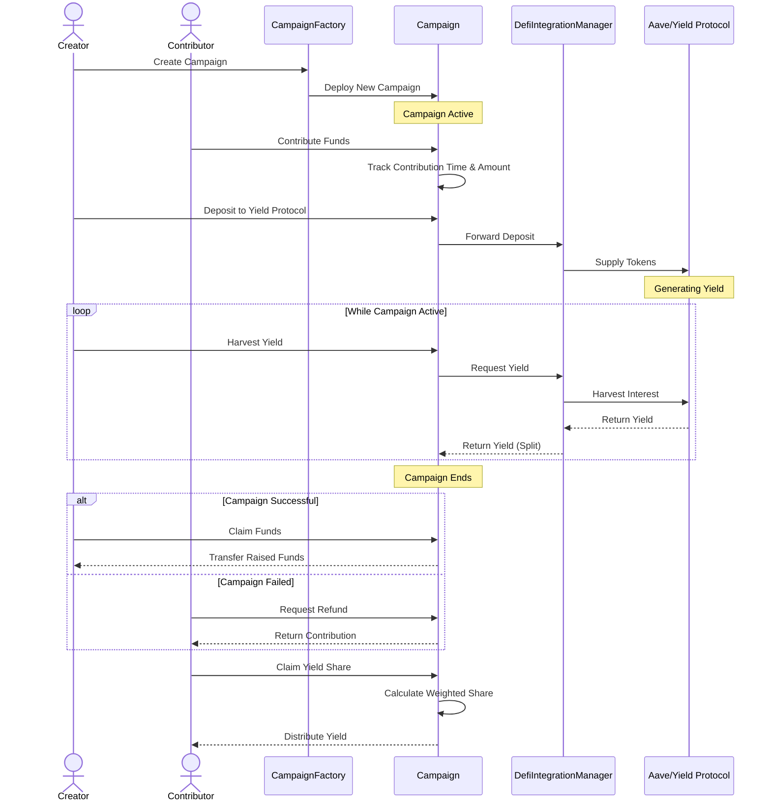
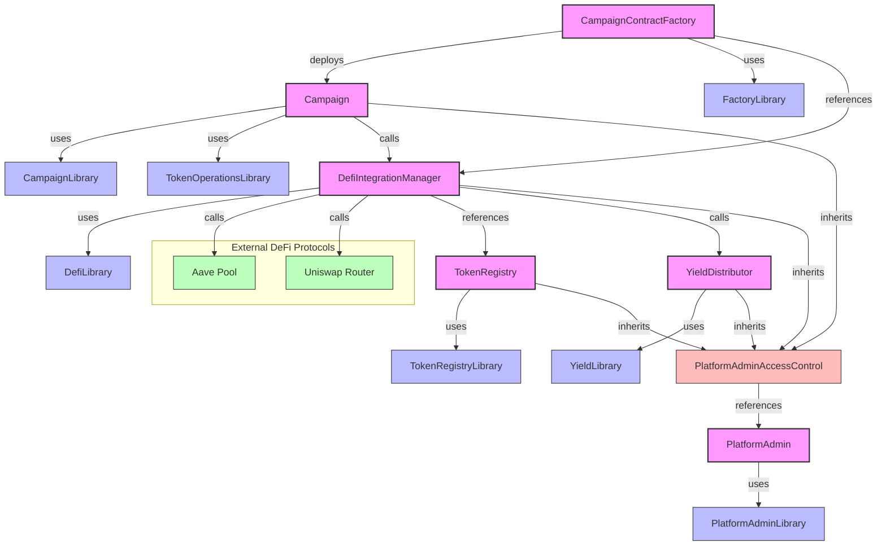

# DeFi Crowdfunding Platform

A decentralized crowdfunding platform that allows campaign creators to earn yield on their raised funds through integration with DeFi protocols like Aave.

## Overview

This platform enables users to create crowdfunding campaigns with specific goals and durations. The unique feature of this platform is that funds raised can be deposited into DeFi protocols to generate yield while the campaign is active. This yield can then be distributed to campaign contributors based on their contribution amount and timing.

### Key Benefits

- **Earn While You Wait**: Campaigns generate yield through DeFi protocols
- **Incentivize Early Contributions**: Earlier contributors receive higher yield shares
- **Multi-token Support**: Accept contributions in various tokens with automatic swapping
- **Secure and Decentralized**: Built on Ethereum with robust security mechanisms

## Smart Contracts Architecture

The platform consists of several contracts that work together:

### Core Contracts

#### Campaign.sol

The main contract that manages individual crowdfunding campaigns. Features:

- Campaign creation with goal amount and duration
- Accepting contributions in various tokens
- Yield generation through DeFi protocols
- Weighted distribution of yield to contributors
- Refund mechanism if the campaign goal is not reached

#### CampaignContractFactory.sol

Factory contract for deploying new Campaign contracts with standardized parameters.

- Deploys new campaigns
- Keeps track of all deployed campaigns
- Validates campaign parameters

#### DefiIntegrationManager.sol

Handles integration with external DeFi protocols (Aave) and token swaps (Uniswap).

- Manages deposits and withdrawals to/from Aave
- Handles token swaps via Uniswap
- Calculates and distributes yield

#### TokenRegistry.sol

Maintains a registry of supported tokens for the platform.

- Add/remove supported tokens
- Set minimum contribution amounts
- Enable/disable token support

#### YieldDistributor.sol

Manages the distribution of yield between campaign creators and the platform.

- Configurable platform yield share
- Treasury address management

#### PlatformAdmin.sol

Handles administrative functions and access control for the platform.

- Manages platform administrators
- Implements grace period functionality
- Controls admin privileges for emergency actions

### Libraries

The system uses several libraries to encapsulate common functionality:

- **CampaignLibrary**: Calculations for campaign timing and yield distribution
- **TokenOperationsLibrary**: Safe token transfer operations
- **DefiLibrary**: Functions for interacting with DeFi protocols
- **FactoryLibrary**: Validation for campaign creation
- **PlatformAdminLibrary**: Grace period calculations
- **TokenRegistryLibrary**: Token validation and conversion
- **YieldLibrary**: Yield share calculations

## Features

### For Campaign Creators

1. **Create campaigns** with specific goals and durations
2. **Accept various tokens** as contributions
3. **Generate yield** on raised funds through Aave
4. **Claim funds** when the campaign goal is reached
5. **Manage yield** by depositing, withdrawing, and harvesting

### For Contributors

1. **Contribute** to campaigns using supported tokens
2. **Earn yield** proportionally to contribution amount and timing
3. **Request refunds** if the campaign doesn't reach its goal
4. **Claim yield** after the campaign ends

### For Platform Administrators

1. **Manage supported tokens**
2. **Set platform yield share**
3. **Emergency intervention** after a grace period
4. **Update configuration** of core components

### User Flow

The following sequence diagram shows the typical user journey through the platform:



## Technical Details

### Yield Generation

Funds are deposited into Aave to generate yield. The platform uses Aave v3's supply functionality to deposit tokens and earn interest.

### Yield Distribution

Yield is distributed based on a weighted contribution system:

- Earlier contributors receive a higher weight
- Distribution is proportional to both amount and timing of contribution
- Platform takes a configurable percentage of all yield

### Token Swapping

The platform supports contributions in various tokens through integration with Uniswap. Tokens are swapped to the campaign's base token automatically.

### Safety Mechanisms

1. **Reentrancy protection** via OpenZeppelin's ReentrancyGuard
2. **Access control** for administrative functions
3. **Grace period** mechanism for emergency interventions
4. **Batch processing** for gas-efficient operations on large datasets
5. **Error codes** for clear error reporting
6. **Slippage protection** for token swaps

## Contract Interactions

### Contract Interaction Flow

```
User/Creator -> CampaignContractFactory -> Deploys Campaign

Contributors -> Campaign -> DefiIntegrationManager -> Aave/Uniswap
                         -> YieldDistributor

PlatformAdmin -> Controls access to admin functions
TokenRegistry -> Validates and configures supported tokens
```

### Contract and Library Architecture Diagram



## Error Handling

The contracts use a consolidated error pattern with error codes for gas efficiency. Each contract defines its own set of error codes for better debugging and front-end integration.

## Events

The contracts emit events for all important state changes to facilitate off-chain tracking and UI updates.

## Development Guidelines

### Prerequisites

- Solidity ^0.8.28
- OpenZeppelin contracts
- Aave V3 interfaces
- Uniswap V3 interfaces

### Framework Compatibility

These contracts are compatible with:

- Hardhat
- Truffle
- Foundry

### Deployment Sequence

1. Deploy `TokenRegistry`
2. Deploy `YieldDistributor`
3. Deploy `PlatformAdmin`
4. Deploy `DefiIntegrationManager` with addresses from steps 1-3
5. Deploy `CampaignContractFactory` with addresses from step 4

### Security Considerations

- All contracts use SafeERC20 for token transfers
- Access control is implemented for administrative functions
- Reentrancy guards are in place for external calls
- Input validation is performed for all user-provided parameters

## License

MIT License
