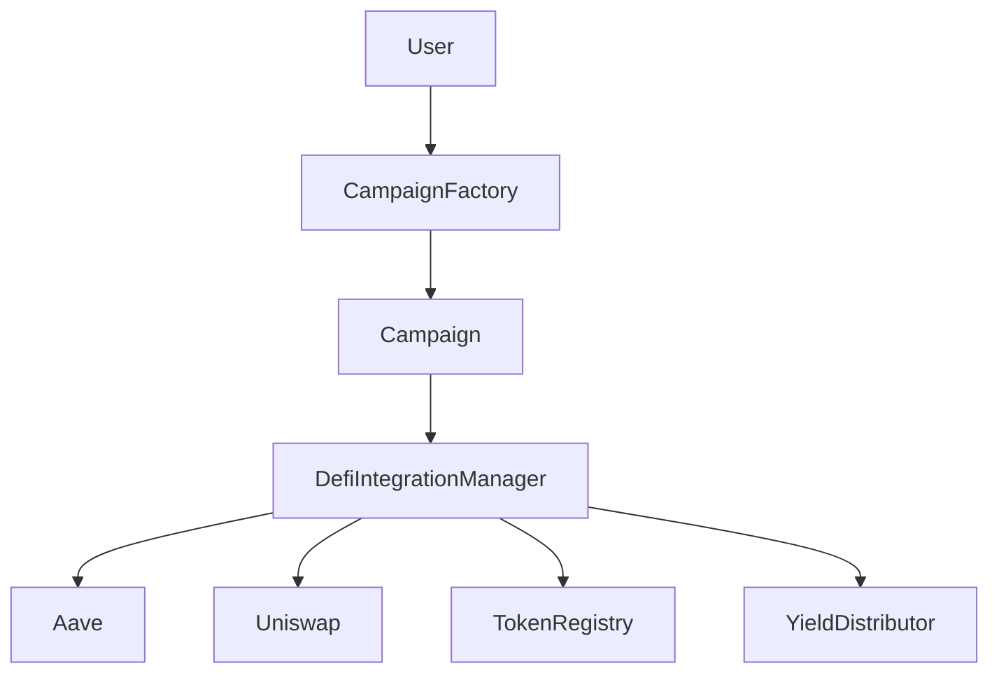

# DeFi-Integrated Crowdfunding Platform

## Overview

A decentralized crowdfunding platform that combines traditional crowdfunding mechanics with DeFi yield generation capabilities. Built on Ethereum/EVM compatible networks, this platform empowers creators while generating additional value through yield strategies.

---

## 📋 Core Features

- **Token-based Campaigns**: Create campaigns to raise funds in any supported ERC20 token
- **Multi-token Contributions**: Contributors can donate using any supported token
- **DeFi Integration**: Seamlessly deposit campaign funds into Aave to generate yield
- **Yield Sharing**: Generated yield is split between creators and platform
- **Full Lifecycle Management**: From creation to funding to claiming/refunds

---

## 🏗️ Architecture

The platform consists of five main smart contracts that work together to provide a complete crowdfunding solution with DeFi capabilities.



### 1. `Campaign.sol`

```solidity
contract Campaign is Ownable, ReentrancyGuard {
    // Core campaign properties
    address public campaignToken;
    uint256 public campaignGoalAmount;
    uint256 public campaignDuration;
    // ...
}
```

Individual crowdfunding campaign contract that:

- Tracks contributions from multiple users
- Accepts contributions in any supported token
- Manages campaign state (active, successful, failed)
- Handles fund claiming and refunds
- Interacts with DeFi protocols through the integration manager

### 2. `CampaignFactory.sol`

```solidity
contract CampaignFactory {
    address[] public deployedCampaigns;
    mapping(address => address[]) public creatorToCampaigns;
    // ...
}
```

Factory contract responsible for:

- Creating new Campaign contracts
- Tracking all deployed campaigns
- Associating campaigns with their creators
- Ensuring proper authorization in the DeFi system

### 3. `DefiIntegrationManager.sol`

```solidity
contract DefiIntegrationManager is Ownable, ReentrancyGuard {
    IAavePool public aavePool;
    ISwapRouter public uniswapRouter;
    // ...
}
```

Central hub for all DeFi interactions that:

- Manages Aave integration for yield generation
- Handles token swaps via Uniswap
- Controls campaign authorization
- Coordinates yield distribution
- Provides an upgradable interface for future DeFi protocols

### 4. `TokenRegistry.sol`

```solidity
contract TokenRegistry is Ownable {
    struct TokenConfig {
        bool isSupported;
        uint8 decimals;
        uint256 minimumContributionAmount;
    }
    // ...
}
```

Registry that:

- Maintains the list of supported ERC20 tokens
- Configures minimum contribution amounts
- Validates token compliance and decimals
- Controls platform token inclusion/exclusion

### 5. `YieldDistributor.sol`

```solidity
contract YieldDistributor is Ownable {
    address public platformTreasury;
    uint16 public platformYieldShare = 2000; // 20%
    // ...
}
```

Manages yield distribution by:

- Setting platform fee percentages
- Routing the platform's share to treasury
- Calculating yield splits (creator vs platform)
- Enforcing maximum platform take rate (50%)

---

## 🔒 Security Features

- **Reentrancy Protection**: `ReentrancyGuard` on all external-facing functions
- **Access Control**: Owner-only and authorized-only function modifiers
- **Slippage Protection**: For token swaps with configurable tolerance
- **Custom Error Types**: Clear, gas-efficient error handling
- **Decimal-Aware Math**: Precision handling for different token decimals
- **Integer Safety**: Fixed-sized types with overflow/underflow protection
- **Address Validation**: Comprehensive zero-address checks

---

## 🔄 Integration Points

| Protocol         | Purpose          | Integration                 |
| ---------------- | ---------------- | --------------------------- |
| **Aave V3**      | Yield generation | Direct pool interaction     |
| **Uniswap V3**   | Token swapping   | Router and quoter contracts |
| **ERC20 Tokens** | Contributions    | SafeERC20 for transfers     |

---

## 🔄 Workflow

1. Platform admin adds supported tokens to the `TokenRegistry`
2. Creator deploys a campaign via `CampaignFactory`
3. Contributors fund the campaign with various tokens
4. Creator may deposit funds to Aave for yield generation
5. Creator can harvest yield during the campaign
6. When campaign ends:
   - **Success**: Creator claims all funds
   - **Failure**: Contributors receive refunds
7. Creator can withdraw deposited funds from yield protocols at any time

---

## 📦 Technical Requirements

- Solidity `^0.8.20` or higher
- OpenZeppelin Contracts for access control and security
- Aave V3 Protocol integration
- Uniswap V3 Protocol integration

---

## 🧪 Testing

Comprehensive test coverage including:

- Unit tests for each contract
- Integration tests for complete workflows
- Edge case testing for security validation
